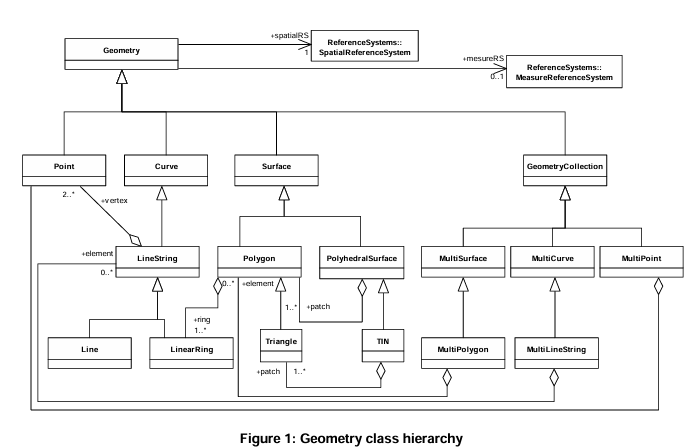

# lang-wkt

A `CodeMirror` Language support extension for WKT(Well Known Text) files.

Template forked from [codemirror/lang-example](https://github.com/codemirror/lang-example).

## Specifications

- [Well Known Text](https://www.ogc.org/publications/standard/sfa/)
  - that production rules are given in section 7.2.2 - 7.2.5
- [Coordinate Reference System](https://www.ogc.org/publications/standard/wkt-crs/)
- [SQL Access](https://www.ogc.org/publications/standard/sfs/)

## Notes

https://www.loc.gov/preservation/digital/formats/fdd/fdd000548.shtml

Test case expressions taken from;
 - https://mapscaping.com/a-guide-to-wkt-in-gis/

This is an example of how the grammar is tested, pretty nice!
 - https://lezer.codemirror.net/examples/test/

Author's notes;
 - https://marijnhaverbeke.nl/blog/lezer.html
   - Lezer was inspired by Atom's parser; https://tree-sitter.github.io/tree-sitter/index.html
 - https://www.youtube.com/watch?v=1qIee0aHOhY
 - hey his blog is great...

community projects
- https://github.com/dennis84/codemirror-themes

## TODO

- how would I go about validating something like polygon winding order?

## CodeMirror 6 language package template

This is an example repository containing a minimal [CodeMirror](https://codemirror.net/6/) language support package. The idea is to clone it, rename it, and edit it to create support for a new language.

Things you'll need to do (see the [language support example](https://codemirror.net/6/examples/lang-package/) for a more detailed tutorial):

 * `git grep EXAMPLE` and replace all instances with your language name.

 * Rewrite the grammar in `src/syntax.grammar` to cover your language. See the [Lezer system guide](https://lezer.codemirror.net/docs/guide/#writing-a-grammar) for information on this file format.

 * Adjust the metadata in `src/index.ts` to work with your new grammar.

 * Adjust the grammar tests in `test/cases.txt`.

 * Build (`npm run prepare`) and test (`npm test`).

 * Rewrite this readme file.

 * Optionally add a license.

 * Publish. Put your package on npm under a name like `codemirror-lang-EXAMPLE`.